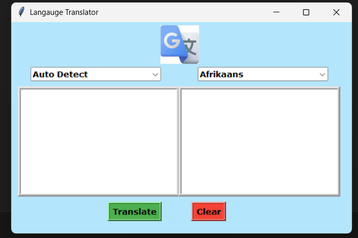

# Language Translator

This project is a **Language Translator Application** built using Python's `Tkinter` library for the GUI and `googletrans` for translation functionality. The app allows users to translate text between different languages with a clean, user-friendly interface.

## Demo(output)



## Features

- **Auto Detect Language:** Automatically detects the source language.
- **Choose Language:** Select from a wide variety of supported languages.
- **Text Translation:** Translates text entered in the source text area to the desired language.
- **Clear Button:** Quickly clears the input and output text areas.
- **Responsive UI:** Designed to work with a 530x330 window size.

## Technologies Used

- **Python**
- **Tkinter** (for GUI)
- **googletrans** (translation API)
- **Pillow** (for image handling)

## Installation

1. Clone this repository or download the source code.
2. Ensure you have Python installed on your system.
3. Install the required libraries:
   ```bash
   pip install pillow googletrans==3.1.0a0
   ```
4. Save the `translator.png` file in the same directory as the script.

## Code Overview

### Libraries Used
- `tkinter`: To create the GUI.
- `googletrans`: To handle language translation.
- `Pillow`: To add the translator icon at the top.
- `messagebox`: To show error messages.

### Key Functions
- **translate()**: Fetches the input text, translates it using `googletrans`, and displays the translated text.
- **clear()**: Clears both the input and output text areas.


## Contribution

Contributions are welcome! Feel free to fork this repository and submit a pull request.
